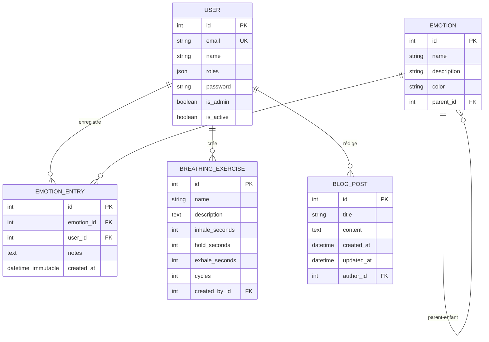
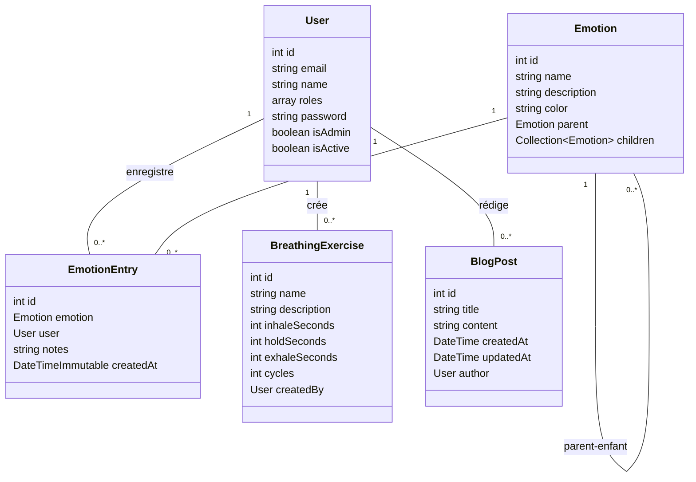

# Schéma de Base de Données - CesiZen

## Diagramme ER



## Description des Tables

### 📋 USER
- **Table utilisateurs** contenant les informations d'authentification
- Columns clés:
  - `id`: Identifiant unique
  - `email`: Adresse email unique
  - `name`: Nom de l'utilisateur
  - `roles`: Tableau des rôles (JSON)
  - `is_admin`: Booléen indiquant si l'utilisateur est admin
  - `is_active`: Booléen pour activer/désactiver le compte

### 🎭 EMOTION
- **Table des émotions** avec structure hiérarchique (parent-enfant)
- Columns clés:
  - `id`: Identifiant unique
  - `name`: Nom de l'émotion
  - `description`: Description optionnelle
  - `color`: Code couleur (hex) pour l'affichage
  - `parent_id`: Référence à l'émotion parent (nullable, auto-relation)

### 📝 EMOTION_ENTRY
- **Enregistrement des émotions** tracées par les utilisateurs
- Columns clés:
  - `id`: Identifiant unique
  - `emotion_id`: Référence à l'émotion (obligatoire)
  - `user_id`: Référence à l'utilisateur (nullable)
  - `notes`: Notes associées à l'émotion
  - `created_at`: Date/heure de création (DateTimeImmutable)

### 🫁 BREATHING_EXERCISE
- **Exercices de respiration** créés par les utilisateurs
- Columns clés:
  - `id`: Identifiant unique
  - `name`: Nom de l'exercice
  - `description`: Description optionnelle
  - `inhale_seconds`: Durée d'inspiration en secondes
  - `hold_seconds`: Durée de rétention en secondes
  - `exhale_seconds`: Durée d'expiration en secondes
  - `cycles`: Nombre de cycles (défaut: 5)
  - `created_by_id`: Utilisateur créateur (cascade delete)

### 📄 BLOG_POST
- **Articles de blog** pour les ressources et conseils
- Columns clés:
  - `id`: Identifiant unique
  - `title`: Titre de l'article
  - `content`: Contenu complet (texte)
  - `created_at`: Date de création
  - `updated_at`: Date de modification (nullable)
  - `author_id`: Utilisateur auteur (obligatoire)

## Diagramme de Classes (Vue Alternatif en Mermaid)



## Relations

| Relation | Type | Description |
|----------|------|-------------|
| User → EmotionEntry | 1-N | Un utilisateur peut avoir plusieurs entrées d'émotions |
| User → BreathingExercise | 1-N | Un utilisateur peut créer plusieurs exercices de respiration |
| User → BlogPost | 1-N | Un utilisateur peut rédiger plusieurs articles |
| Emotion → EmotionEntry | 1-N | Une émotion peut être associée à plusieurs entrées |
| Emotion → Emotion | 1-N (auto) | Une émotion peut avoir plusieurs enfants (hiérarchie) |

---

# 📚 Description Détaillée des Entités

## 1️⃣ Entité USER

### Description générale
L'entité `User` représente un utilisateur enregistré dans le système. Elle gère l'authentification, les rôles et les permissions. Chaque utilisateur peut créer des entrées d'émotions, des exercices de respiration et des articles de blog.

### Propriétés

| Propriété | Type | Nullable | Unique | Description |
|-----------|------|----------|--------|-------------|
| `id` | INT | ❌ | ✅ | Identifiant unique de l'utilisateur (clé primaire) |
| `email` | STRING(180) | ❌ | ✅ | Adresse email unique pour l'authentification et la récupération de compte |
| `name` | STRING(100) | ✅ | ❌ | Nom complet de l'utilisateur |
| `roles` | JSON | ❌ | ❌ | Tableau des rôles personnalisés (JSON) |
| `password` | STRING | ❌ | ❌ | Mot de passe hashé (non réversible) utilisant bcrypt |
| `isAdmin` | BOOLEAN | ❌ | ❌ | Flag indiquant si l'utilisateur est administrateur (défaut: false) |
| `isActive` | BOOLEAN | ❌ | ❌ | Flag pour activer/désactiver le compte (défaut: true) |

### Fonctions principales

#### Authentification
```php
getUserIdentifier(): string
```
- Retourne l'email de l'utilisateur
- Utilisé par Symfony pour l'identification unique

```php
getPassword(): ?string
setPassword(string $password): self
```
- Getter/Setter pour le mot de passe hashé
- Le mot de passe est toujours stocké en hash bcrypt

```php
eraseCredentials(): void
```
- Efface les données sensibles après authentification
- Protège contre les fuites de mémoire

#### Gestion des rôles
```php
getRoles(): array
```
- Retourne tous les rôles de l'utilisateur
- Ajoute automatiquement 'ROLE_USER' à chaque utilisateur
- Ajoute 'ROLE_ADMIN' si isAdmin est true
- Retourne un tableau unique (pas de doublons)

```php
setRoles(array $roles): self
```
- Définit les rôles personnalisés de l'utilisateur

#### Gestion des droits administrateur
```php
isAdmin(): boolean
setIsAdmin(bool $isAdmin): self
```
- Gère le statut administrateur
- Affecte les rôles disponibles

#### Gestion du compte
```php
isActive(): boolean
setIsActive(bool $isActive): self
```
- Contrôle si le compte est actif ou désactivé

#### Informations personnelles
```php
getName(): ?string
setName(?string $name): self
```
- Getter/Setter pour le nom de l'utilisateur

```php
getEmail(): ?string
setEmail(string $email): self
```
- Getter/Setter pour l'email (doit être unique)

### Cas d'usage
- ✅ Créer un nouveau compte utilisateur
- ✅ Se connecter/déconnecter
- ✅ Modifier profil et email
- ✅ Promouvoir/rétrogader administrateur
- ✅ Désactiver compte temporairement
- ✅ Tracker des émotions personnalisées
- ✅ Créer des exercices de respiration
- ✅ Rédiger des articles de blog

---

## 2️⃣ Entité EMOTION

### Description générale
L'entité `Emotion` représente un catalogue d'émotions dans le système. Elle supporte une **hiérarchie parent-enfant** permettant de catégoriser les émotions de manière progressive (ex: "Tristesse" parent de "Dépression", "Mélancolie"). Chaque émotion peut être affichée avec une couleur spécifique pour une meilleure UX.

### Propriétés

| Propriété | Type | Nullable | Unique | Description |
|-----------|------|----------|--------|-------------|
| `id` | INT | ❌ | ✅ | Identifiant unique de l'émotion (clé primaire) |
| `name` | STRING(255) | ❌ | ❌ | Nom de l'émotion (ex: "Joie", "Colère", "Peur") |
| `description` | STRING(255) | ✅ | ❌ | Description détaillée de l'émotion |
| `color` | STRING(7) | ✅ | ❌ | Code couleur hexadécimal (#RRGGBB) pour l'affichage |
| `parent` | Emotion | ✅ | ❌ | Référence à l'émotion parent (auto-relation) |
| `children` | Collection<Emotion> | ❌ | ❌ | Collection des émotions enfants (inverse) |

### Fonctions principales

#### Gestion des propriétés simples
```php
getId(): ?int
```
- Retourne l'ID unique

```php
getName(): ?string
setName(string $name): self
```
- Getter/Setter pour le nom de l'émotion

```php
getDescription(): ?string
setDescription(?string $description): self
```
- Getter/Setter pour la description

```php
getColor(): ?string
setColor(?string $color): self
```
- Getter/Setter pour le code couleur hexadécimal

#### Gestion de la hiérarchie (Parent-Enfant)
```php
getParent(): ?Emotion
setParent(?Emotion $parent): self
```
- Getter/Setter pour l'émotion parent
- Peut être null pour les émotions racines

```php
getChildren(): Collection
```
- Retourne la collection de toutes les émotions enfants

```php
addChild(Emotion $child): self
```
- Ajoute une émotion enfant
- Définit automatiquement le parent de l'enfant
- Évite les doublons avec `contains()`

```php
removeChild(Emotion $child): self
```
- Supprime une émotion enfant
- Reset le parent de l'enfant à null si la relation était active

### Cas d'usage
- ✅ Créer une hiérarchie d'émotions
- ✅ Afficher un arbre d'émotions dans l'UI
- ✅ Catégoriser les entrées d'émotions
- ✅ Assigner une couleur pour le codage visuel
- ✅ Permettre des émotions parent et enfant
- ✅ Faciliter la compréhension progressive des émotions

### Exemple d'hiérarchie
```
Joie (parent)
├── Exaltation
├── Bonheur
└── Sérénité

Tristesse (parent)
├── Mélancolie
├── Dépression
└── Déception
```

---

## 3️⃣ Entité EMOTION_ENTRY

### Description générale
L'entité `EmotionEntry` enregistre chaque fois qu'un utilisateur trace une émotion. C'est le cœur du système de suivi des émotions. Elle crée un historique des émotions ressenties au fil du temps, permettant une analyse et une réflexion.

### Propriétés

| Propriété | Type | Nullable | Unique | Description |
|-----------|------|----------|--------|-------------|
| `id` | INT | ❌ | ✅ | Identifiant unique de l'enregistrement (clé primaire) |
| `emotion` | Emotion | ❌ | ❌ | Référence à l'émotion ressentie (relation obligatoire) |
| `user` | User | ✅ | ❌ | Référence à l'utilisateur (peut être null pour anon) |
| `notes` | TEXT | ✅ | ❌ | Notes/contexte associés à l'émotion (ex: explications) |
| `createdAt` | DateTimeImmutable | ❌ | ❌ | Timestamp d'enregistrement (immuable) |

### Fonctions principales

#### Gestion de l'émotion
```php
getEmotion(): ?Emotion
setEmotion(Emotion $emotion): self
```
- Getter/Setter pour l'émotion ressentie
- L'émotion est obligatoire

#### Gestion de l'utilisateur
```php
getUser(): ?User
setUser(?User $user): self
```
- Getter/Setter pour l'utilisateur
- Peut être null pour permettre les enregistrements anonymes

#### Gestion des notes
```php
getNotes(): ?string
setNotes(?string $notes): self
```
- Getter/Setter pour les notes textuelles
- Permet à l'utilisateur d'expliquer son ressenti

#### Gestion du timestamp
```php
getId(): ?int
getCreatedAt(): DateTimeImmutable
```
- Retourne l'ID
- Retourne la date/heure immuable de création (auto-initialisée)

### Cas d'usage
- ✅ Enregistrer une émotion ressentie
- ✅ Ajouter un contexte/note à l'émotion
- ✅ Créer un historique temporel des émotions
- ✅ Analyser les tendances émotionnelles
- ✅ Permettre l'auto-réflexion et le suivi
- ✅ Générer des graphiques/statiques sur les émotions
- ✅ Supporter les enregistrements anonymes

### Exemple d'utilisation
```
User: Alice enregistre "Joie" le 18/05/2026 10:30
Notes: "J'ai réussi ma présentation!"

User: Alice enregistre "Anxiété" le 18/05/2026 14:00
Notes: "Réunion avec le patron cet après-midi"
```

---

## 4️⃣ Entité BREATHING_EXERCISE

### Description générale
L'entité `BreathingExercise` représente un exercice de respiration guidé. Elle permet aux utilisateurs de créer et partager des techniques de respiration personnalisées (ex: respiration 4-7-8, respiration carrée). Chaque exercice définit les durées d'inspiration, rétention et expiration.

### Propriétés

| Propriété | Type | Nullable | Unique | Description |
|-----------|------|----------|--------|-------------|
| `id` | INT | ❌ | ✅ | Identifiant unique de l'exercice (clé primaire) |
| `name` | STRING(255) | ❌ | ❌ | Nom de l'exercice (ex: "Respiration 4-7-8") |
| `description` | TEXT | ✅ | ❌ | Description détaillée et instructions |
| `inhaleSeconds` | INT | ❌ | ❌ | Durée d'inspiration en secondes |
| `holdSeconds` | INT | ❌ | ❌ | Durée de rétention (pause) en secondes |
| `exhaleSeconds` | INT | ❌ | ❌ | Durée d'expiration en secondes |
| `cycles` | INT | ❌ | ❌ | Nombre de cycles à répéter (défaut: 5) |
| `createdBy` | User | ✅ | ❌ | Utilisateur créateur (cascade delete) |

### Fonctions principales

#### Gestion des propriétés simples
```php
getId(): ?int
```
- Retourne l'ID unique

```php
getName(): ?string
setName(string $name): self
```
- Getter/Setter pour le nom

```php
getDescription(): ?string
setDescription(?string $description): self
```
- Getter/Setter pour la description/instructions

#### Gestion des durées de respiration
```php
getInhaleSeconds(): ?int
setInhaleSeconds(int $inhaleSeconds): self
```
- Getter/Setter pour la durée d'inspiration

```php
getHoldSeconds(): ?int
setHoldSeconds(int $holdSeconds): self
```
- Getter/Setter pour la durée de rétention (apnée)

```php
getExhaleSeconds(): ?int
setExhaleSeconds(int $exhaleSeconds): self
```
- Getter/Setter pour la durée d'expiration

#### Gestion des cycles
```php
getCycles(): ?int
setCycles(int $cycles): self
```
- Getter/Setter pour le nombre de cycles
- Défaut: 5 cycles

#### Gestion du créateur
```php
getCreatedBy(): ?User
setCreatedBy(?User $createdBy): self
```
- Getter/Setter pour l'utilisateur créateur
- Suppression en cascade si l'utilisateur est supprimé

### Cas d'usage
- ✅ Créer des exercices de respiration personnalisés
- ✅ Partager des techniques de respiration
- ✅ Utiliser un exercice pour gérer le stress/anxiété
- ✅ Générer une animation/timer basé sur les durées
- ✅ Suivre l'historique des exercices
- ✅ Créer des routines de respiration

### Exemples d'exercices
```
Exercice #1: "Respiration 4-7-8"
Inhale: 4s, Hold: 7s, Exhale: 8s, Cycles: 5

Exercice #2: "Respiration Carrée"
Inhale: 4s, Hold: 4s, Exhale: 4s, Cycles: 10

Exercice #3: "Cohérence Cardiaque"
Inhale: 5s, Hold: 0s, Exhale: 5s, Cycles: 6
```

---

## 5️⃣ Entité BLOG_POST

### Description générale
L'entité `BlogPost` représente un article de blog. Elle permet aux administrateurs et contributeurs de publier du contenu éducatif sur la gestion des émotions et le bien-être mental. Les articles peuvent être brouillons, publiés ou dépubliés.

### Propriétés

| Propriété | Type | Nullable | Unique | Description |
|-----------|------|----------|--------|-------------|
| `id` | INT | ❌ | ✅ | Identifiant unique de l'article (clé primaire) |
| `title` | STRING(255) | ❌ | ❌ | Titre de l'article |
| `content` | TEXT | ❌ | ❌ | Contenu complet de l'article (Markdown possible) |
| `createdAt` | DateTime | ❌ | ❌ | Date/heure de création (auto-initialisée) |
| `updatedAt` | DateTime | ✅ | ❌ | Date/heure de dernière modification |
| `author` | User | ❌ | ❌ | Utilisateur auteur de l'article (relation obligatoire) |

### Fonctions principales

#### Gestion du titre et contenu
```php
getTitle(): ?string
setTitle(string $title): self
```
- Getter/Setter pour le titre de l'article

```php
getContent(): ?string
setContent(string $content): self
```
- Getter/Setter pour le contenu complet
- Peut supporter Markdown ou HTML

#### Gestion des dates
```php
getCreatedAt(): ?DateTimeInterface
setCreatedAt(DateTimeInterface $createdAt): self
```
- Getter/Setter pour la date de création
- Auto-initialisé à new DateTime() dans le constructeur

```php
getUpdatedAt(): ?DateTimeInterface
setUpdatedAt(?DateTimeInterface $updatedAt): self
```
- Getter/Setter pour la date de modification
- Peut être null (jamais modifié)

#### Gestion de l'auteur
```php
getAuthor(): ?User
setAuthor(?User $author): self
```
- Getter/Setter pour l'utilisateur auteur
- Obligatoire pour tout article

### Cas d'usage
- ✅ Rédiger des articles éducatifs sur les émotions
- ✅ Publier des conseils et ressources
- ✅ Modifier articles après création
- ✅ Archiver/supprimer des articles
- ✅ Afficher l'historique de modification

### Exemple d'article
```
Titre: "Techniques de Respiration pour Gérer l'Anxiété"
Auteur: Alice (Admin)
Créé: 18/05/2026 09:00
Modifié: 18/05/2026 14:30

Contenu:
# Gestion de l'Anxiété par la Respiration

L'anxiété est une réponse naturelle. Voici 3 techniques...

1. Respiration 4-7-8
2. Respiration Carrée
3. Cohérence Cardiaque
```

---

# 🔗 Interactions entre Entités

## Flux d'une entrée d'émotion typique
```
User crée une EmotionEntry
│
├─→ Sélectionne une Emotion (ex: "Joie")
├─→ Ajoute des notes (optionnel)
└─→ Le système enregistre createdAt automatiquement

Résultat: Une trace historique de ses émotions
```

## Flux d'un exercice de respiration
```
User crée un BreathingExercise
│
├─→ Définit les durées (inhale, hold, exhale)
├─→ Définit le nombre de cycles
└─→ Ajoute une description

Résultat: Un exercice réutilisable pour gérer l'émotion
```

## Flux d'un article de blog
```
Admin rédige un BlogPost
│
├─→ Rédige titre + contenu
├─→ Crée et publie l'article
└─→ Article devient directement accessible aux utilisateurs

Résultat: Du contenu éducatif pour les utilisateurs
```

